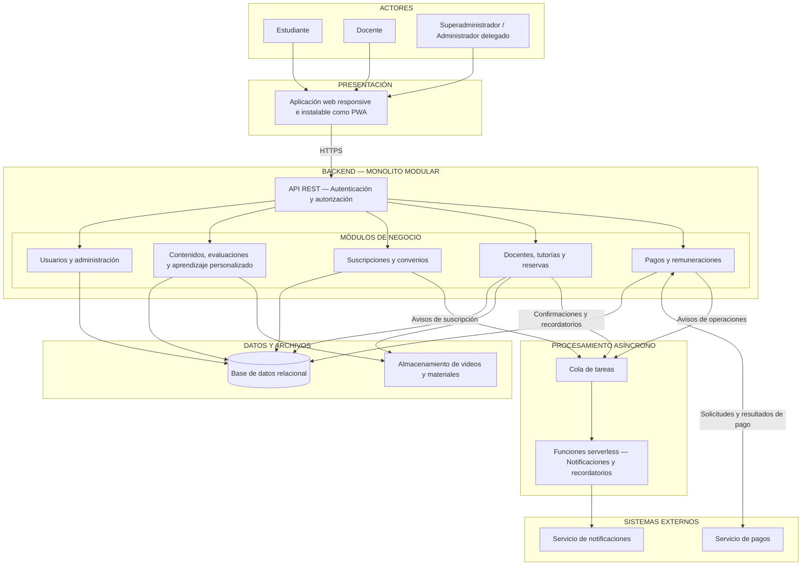

# Arquitectura inicial de Mentelyx

```mermaid
flowchart TD

    subgraph ACTORES["ACTORES"]
        Estudiante["Estudiante"]
        Docente["Docente"]
        Administrador["Superadministrador / Administrador delegado"]
    end

    subgraph PRESENTACION["PRESENTACIÓN"]
        PWA["Aplicación web responsive e instalable como PWA"]
    end

    subgraph BACKEND["BACKEND — MONOLITO MODULAR"]
        API["API REST — Autenticación y autorización"]

        subgraph NEGOCIO["MÓDULOS DE NEGOCIO"]
            Usuarios["Usuarios y administración"]
            Aprendizaje["Contenidos, evaluaciones y aprendizaje personalizado"]
            Acceso["Suscripciones y convenios"]
            Tutorias["Docentes, tutorías y reservas"]
            Pagos["Pagos y remuneraciones"]
        end
    end

    subgraph DATOS["DATOS Y ARCHIVOS"]
        BD[("Base de datos relacional")]
        Archivos["Almacenamiento de videos y materiales"]
    end

    subgraph ASINCRONO["PROCESAMIENTO ASÍNCRONO"]
        Cola["Cola de tareas"]
        Funciones["Funciones serverless — Notificaciones y recordatorios"]
    end

    subgraph EXTERNOS["SISTEMAS EXTERNOS"]
        Pasarela["Servicio de pagos"]
        Notificaciones["Servicio de notificaciones"]
    end

    Estudiante --> PWA
    Docente --> PWA
    Administrador --> PWA

    PWA -->|"HTTPS"| API

    API --> Usuarios
    API --> Aprendizaje
    API --> Acceso
    API --> Tutorias
    API --> Pagos

    Usuarios --> BD
    Aprendizaje --> BD
    Acceso --> BD
    Tutorias --> BD
    Pagos --> BD

    Aprendizaje --> Archivos
    Tutorias --> Archivos

    Pagos <-->|"Solicitudes y resultados de pago"| Pasarela

    Acceso -->|"Avisos de suscripción"| Cola
    Tutorias -->|"Confirmaciones y recordatorios"| Cola
    Pagos -->|"Avisos de operaciones"| Cola

    Cola --> Funciones
    Funciones --> Notificaciones
```