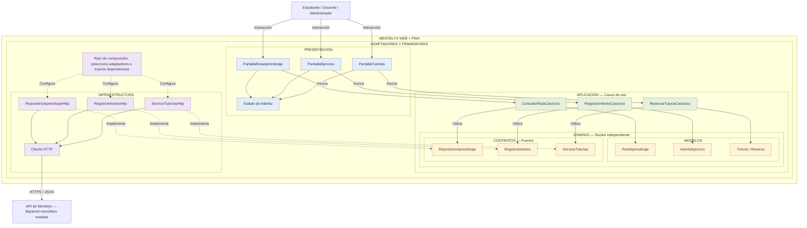

# Enfoque arquitectónico de Mentelyx

## Enfoque seleccionado

| Elemento | Descripción aplicada a Mentelyx |
|---|---|
| Enfoque arquitectónico | Clean Architecture. |
| Alcance del diagrama | Organización interna del frontend Web + PWA. |
| Objetivo | Separar las pantallas, los casos de uso, los modelos y la comunicación con el backend. |
| Problema que resuelve | Evitar que los componentes visuales dependan directamente de solicitudes HTTP y de los detalles de los servicios externos. |
| Capas definidas | Presentación, Aplicación, Dominio e Infraestructura. |
| Beneficios | Facilitar las pruebas, el mantenimiento y la sustitución de adaptadores sin modificar innecesariamente las pantallas o los casos de uso. |

## Diagrama

## Responsabilidades

### Presentación

Contiene las pantallas, componentes visuales y estado de la interfaz.

Permite mostrar la ruta de aprendizaje, resolver ejercicios y solicitar
reservas de tutorías.

Los componentes invocan casos de uso y muestran sus resultados.
No realizan directamente las solicitudes HTTP.

El estado de interfaz incluye elementos como indicadores de carga,
selecciones y mensajes de error. No constituye la fuente autorizada
de pagos, permisos o reservas.

### Aplicación

Contiene los casos de uso del frontend.

| Caso de uso | Responsabilidad |
|---|---|
| ConsultarRutaCasoUso | Solicitar la ruta del estudiante mediante el contrato correspondiente y entregar el resultado a Presentación. |
| RegistrarIntentoCasoUso | Preparar y enviar el intento del estudiante y obtener la respuesta del backend. |
| ReservarTutoriaCasoUso | Solicitar una reserva y devolver el estado informado por el backend. |

Estos casos de uso conocen los modelos y contratos del Dominio.
No conocen los adaptadores HTTP concretos.

### Dominio

Contiene los modelos y contratos utilizados por los casos de uso.

| Tipo | Elementos |
|---|---|
| Modelos | RutaAprendizaje, IntentoEjercicio, Tutoria y Reserva. |
| Contratos | RepositorioAprendizaje, RegistroIntentos y ServicioTutorias. |

Los contratos expresan las operaciones necesarias sin especificar
cómo se obtiene o transmite la información.

El núcleo no depende del framework de interfaz, del navegador ni
de una biblioteca HTTP.

### Infraestructura

Implementa los contratos mediante adaptadores.

| Contrato | Implementación inicial |
|---|---|
| RepositorioAprendizaje | RepositorioAprendizajeHttp. |
| RegistroIntentos | RegistroIntentosHttp. |
| ServicioTutorias | ServicioTutoriasHttp. |

Los adaptadores utilizan el cliente HTTP para comunicarse con la API
de Mentelyx y transformar las respuestas en los modelos correspondientes.

Para pruebas podrán utilizarse implementaciones en memoria que cumplan
los mismos contratos.

### Raíz de composición

Es el punto de configuración que selecciona las implementaciones
y las proporciona a los casos de uso.

Por ejemplo, conecta RepositorioAprendizajeHttp con
ConsultarRutaCasoUso mediante el contrato RepositorioAprendizaje.

Los casos de uso no crean directamente sus adaptadores.

## Reglas de dependencia

1. Presentación utiliza los casos de uso de Aplicación.

2. Aplicación depende de los modelos y contratos del Dominio.

3. Infraestructura implementa los contratos del Dominio.

4. Dominio no depende de las demás capas.

5. La raíz de composición conecta las implementaciones concretas.

6. Las flechas entre componentes representan dependencias o uso.
   Las conexiones con el usuario y el backend representan interacción externa.

## Relación con el backend

Esta vista organiza el frontend; no traslada las reglas críticas
del servidor al navegador.

El backend conservará la responsabilidad de:

- Verificar identidad, permisos y beneficios.
- Evaluar y registrar los resultados académicos.
- Calcular y actualizar la personalización del aprendizaje.
- Comprobar cupos y confirmar reservas.
- Verificar pagos y calcular liquidaciones docentes.

El frontend mostrará los estados devueltos por el backend y no podrá
confirmar por sí mismo una operación económica o una reserva.

## Relación con serverless

El frontend se comunicará con la API de Mentelyx.

El backend preparará las tareas de notificación y las publicará
mediante sus adaptadores.

Las funciones EnviarNotificacion y ActivarRecordatorios permanecerán
en la arquitectura global, fuera del frontend. No se consideran capas
de Clean Architecture.