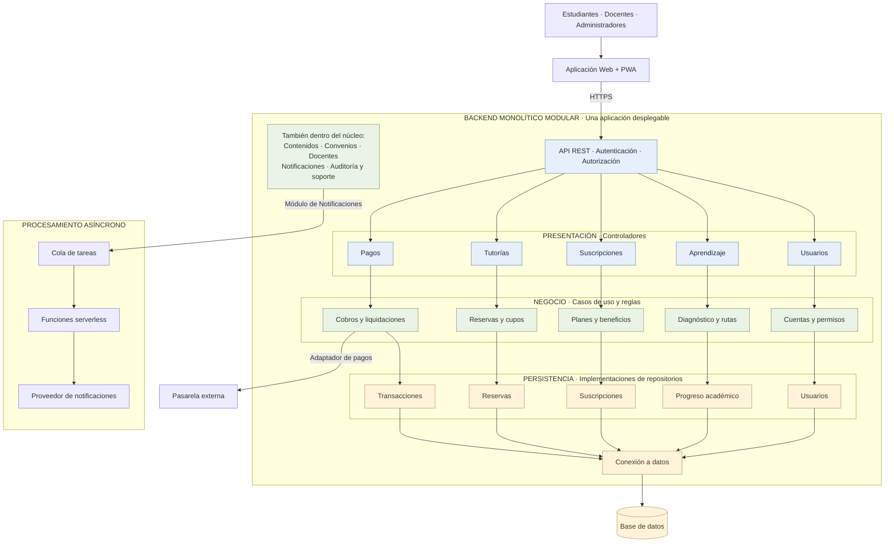

# Estilo arquitectónico de Mentelyx

Mentelyx tendrá un frontend Web + PWA y un backend monolítico modular.
Las notificaciones y los recordatorios se procesarán mediante capacidades
serverless complementarias.

## Diagrama

## Alcance de la vista

Se detallan cinco módulos para mostrar su organización. Los módulos
adicionales también pertenecen al mismo núcleo y siguen la misma
separación de responsabilidades.

Las flechas verticales representan llamadas durante la ejecución:
controlador, caso de uso y repositorio utilizado mediante un contrato.
No representan las dependencias de código de Clean Architecture.

El almacenamiento de archivos y la caché propuesta se omiten en esta
vista resumida. Se mantienen en el diseño general de la plataforma.