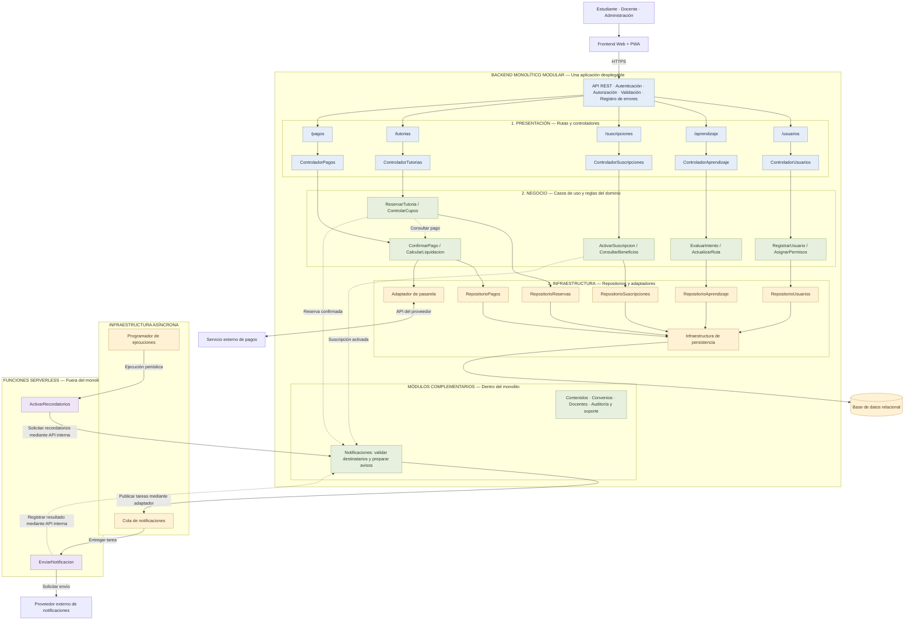

# Estilo arquitectónico de Mentelyx

## Estilo seleccionado

Mentelyx utilizará una estructura cliente-servidor con un backend
monolítico modular y procesamiento complementario serverless.

El frontend será una aplicación web responsive y mobile-first,
instalable como PWA.

Los módulos del núcleo se ejecutarán dentro de una misma aplicación
desplegable. Las funciones serverless realizarán el envío de
notificaciones y la activación periódica de recordatorios.

## Diagrama

## Distribución de responsabilidades

| Componente | Ubicación | Responsabilidad |
|---|---|---|
| Frontend Web + PWA | Cliente | Presentar las funciones disponibles según el usuario y comunicarse con la API. |
| Módulos del negocio | Monolito modular | Gestionar usuarios, aprendizaje, contenidos, suscripciones, convenios, docentes, tutorías y operaciones económicas. |
| Módulo de Notificaciones | Monolito modular | Determinar los avisos válidos, sus destinatarios y contenido, y registrar su procesamiento. |
| ActivarRecordatorios | Función serverless | Solicitar periódicamente al backend la preparación de los recordatorios pendientes. |
| EnviarNotificacion | Función serverless | Procesar tareas de la cola, solicitar su envío al proveedor y comunicar el resultado al backend. |
| Cola de notificaciones | Infraestructura asíncrona | Conservar y entregar tareas pendientes. |
| Programador de ejecuciones | Infraestructura asíncrona | Activar periódicamente la función de recordatorios. |

## Reglas de organización

1. Los módulos del núcleo compartirán una unidad de despliegue,
   manteniendo responsabilidades delimitadas.

2. La comunicación entre módulos se realizará mediante interfaces
   internas. Un módulo no modificará directamente los datos de otro.

3. Las reglas educativas, comerciales y de autorización permanecerán
   en el backend.

4. Las funciones serverless accederán a las operaciones internas
   mediante mecanismos autenticados y permisos limitados.

5. Antes de preparar un recordatorio, el backend verificará que
   la tutoría y sus destinatarios continúen siendo válidos.

6. Un fallo en el envío de una notificación no anulará una reserva
   o un pago confirmado.

7. El procesamiento de tareas contemplará reintentos y controles
   para evitar duplicados.

## Lectura del diagrama

- Las columnas detalladas representan cinco módulos del núcleo.
- Los módulos complementarios se muestran resumidos para mantener
  la legibilidad.
- Las flechas continuas representan comunicación durante la ejecución.
- Las flechas discontinuas identifican colaboraciones o notificaciones
  entre componentes.
- La cola y el programador son infraestructura de apoyo; no son
  funciones serverless.
- Las conexiones internas de recordatorios y resultados representan
  operaciones protegidas de la API, resumidas en el diagrama.
- Las flechas no representan las dependencias del código de
  Clean Architecture.

## Elementos complementarios

Los videos y materiales se conservarán en almacenamiento de archivos
integrado mediante adaptadores.

La caché de recursos estáticos y consultas públicas se mantiene como
propuesta ADR-012. Su incorporación no sustituirá la validación de pagos,
permisos o cupos en las operaciones del negocio.

Estos elementos se omiten en esta vista resumida para destacar
la estructura modular y la distribución del procesamiento.

## Decisiones relacionadas

- ADR-001: núcleo de negocio mediante monolito modular.
- ADR-003: frontend Web + PWA conectado mediante API REST.
- ADR-005: integración de pagos mediante contratos y adaptadores.
- ADR-008: notificaciones y recordatorios mediante funciones serverless.
- ADR-009: almacenamiento separado de archivos.