# Estilo arquitectónico de Mentelyx

Mentelyx utiliza una estructura cliente-servidor con un frontend Web + PWA,
un backend monolítico modular y procesamiento complementario serverless.

Los módulos del núcleo forman una misma aplicación desplegable.
Se comunican mediante operaciones internas definidas y mantienen
responsabilidades delimitadas.

## Diagrama

```mermaid
flowchart TB

    subgraph ACTORES["ACTORES"]
        EST["Estudiante"]
        DOC["Docente"]
        ADM["Superadministrador y administradores"]
    end

    WEB["Frontend Web + PWA<br/>Responsive e instalable"]

    EST --> WEB
    DOC --> WEB
    ADM --> WEB

    subgraph MONOLITO["BACKEND MONOLÍTICO MODULAR — Una aplicación desplegable"]

        API["API REST<br/>Autenticación · Autorización · Validación de entrada"]

        subgraph PRINCIPALES["MÓDULOS PRINCIPALES — Detalle de responsabilidades"]
            direction LR

            subgraph USUARIOS["Identidad y acceso"]
                direction TB
                UC["Controlador de usuarios"]
                UU["Casos de uso<br/>Registrar usuario<br/>Asignar permisos"]
                UR["Adaptador de persistencia<br/>Usuarios y roles"]

                UC --> UU
                UU -->|"Contrato de repositorio"| UR
            end

            subgraph APRENDIZAJE["Evaluación y aprendizaje"]
                direction TB
                AC["Controlador de aprendizaje"]
                AU["Casos de uso y reglas<br/>Evaluar respuestas<br/>Actualizar perfil y ruta"]
                AR["Adaptador de persistencia<br/>Evaluaciones y progreso"]

                AC --> AU
                AU -->|"Contrato de repositorio"| AR
            end

            subgraph SUSCRIPCIONES["Planes y suscripciones"]
                direction TB
                SC["Controlador de suscripciones"]
                SU["Casos de uso y reglas<br/>Activar suscripción<br/>Determinar beneficios"]
                SR["Adaptador de persistencia<br/>Planes y suscripciones"]

                SC --> SU
                SU -->|"Contrato de repositorio"| SR
            end

            subgraph TUTORIAS["Tutorías y reservas"]
                direction TB
                TC["Controlador de tutorías"]
                TU["Casos de uso y reglas<br/>Reservar tutoría<br/>Controlar cupos"]
                TR["Adaptador de persistencia<br/>Tutorías y reservas"]

                TC --> TU
                TU -->|"Contrato de repositorio"| TR
            end

            subgraph PAGOS["Pagos y remuneraciones"]
                direction TB
                PC["Controlador de pagos<br/>Recepción de notificaciones"]
                PU["Casos de uso y reglas<br/>Verificar pago<br/>Calcular liquidación"]
                PR["Adaptadores<br/>Persistencia e integración de pagos"]

                PC --> PU
                PU -->|"Contratos de integración"| PR
            end
        end

        subgraph APOYO["OTROS MÓDULOS DEL MISMO NÚCLEO"]
            CONT["Contenidos educativos"]
            CONV["Convenios"]
            DOCE["Gestión de docentes"]
            NOTI["Notificaciones<br/>Preparar avisos y recordatorios"]
            AUD["Auditoría y soporte"]
        end

        API --> UC
        API --> AC
        API --> SC
        API --> TC
        API --> PC

        API -->|"Operaciones autorizadas"| CONT
        API -->|"Operaciones autorizadas"| CONV
        API -->|"Operaciones autorizadas"| DOCE
        API -->|"Operaciones autorizadas"| AUD

        AU -.->|"Consultar recursos"| CONT
        SU -.->|"Consultar beneficios"| CONV
        TU -.->|"Verificar docente"| DOCE

        TU -.->|"Consultar estado de pago"| PU
        SU -.->|"Consultar estado de pago"| PU

        TU -.->|"Aviso de reserva confirmada"| NOTI
        SU -.->|"Aviso de suscripción"| NOTI
        PU -.->|"Aviso de operación económica"| NOTI

        DATOS["Acceso a datos del núcleo<br/>Cada módulo controla sus escrituras"]
    end

    WEB -->|"HTTPS / JSON"| API

    UC ~~~ AC
    AC ~~~ SC
    SC ~~~ TC
    TC ~~~ PC

    UR --> DATOS
    AR --> DATOS
    SR --> DATOS
    TR --> DATOS
    PR --> DATOS

    CONT --> DATOS
    CONV --> DATOS
    DOCE --> DATOS
    AUD --> DATOS

    BD[("Base de datos relacional")]
    ARCH["Almacenamiento de archivos<br/>Videos, imágenes y materiales"]
    CACHE[("Caché de consultas públicas<br/>Propuesta ADR-012")]

    DATOS --> BD
    CONT --> ARCH
    DOCE --> ARCH
    CONT -.->|"Catálogo público"| CACHE
    DOCE -.->|"Perfiles públicos"| CACHE

    subgraph ASINCRONO["PROCESAMIENTO COMPLEMENTARIO — Fuera del monolito"]
        COLA["Cola de tareas"]
        FN["Funciones serverless<br/>Envío de avisos y recordatorios"]

        COLA --> FN
    end

    NOTI -->|"Publicar tareas"| COLA

    PASARELA["Servicio externo de pagos"]
    MENSAJERIA["Servicio externo de notificaciones"]

    PR <-->|"Solicitudes y resultados"| PASARELA
    FN -->|"Solicitar entrega"| MENSAJERIA

    classDef entrada fill:#e4eefb,stroke:#4275a8,color:#172b40;
    classDef negocio fill:#e9f3e7,stroke:#6a9462,color:#233e23;
    classDef infraestructura fill:#fff2d6,stroke:#b69a54,color:#493d22;
    classDef externo fill:#f0e8f8,stroke:#9275ad,color:#3f2e50;

    class WEB,API,UC,AC,SC,TC,PC entrada;
    class UU,AU,SU,TU,PU,CONT,CONV,DOCE,NOTI,AUD negocio;
    class UR,AR,SR,TR,PR,DATOS,BD,ARCH,CACHE infraestructura;
    class COLA,FN,PASARELA,MENSAJERIA externo;
```

## Lectura del diagrama

- Cada columna detallada representa un módulo del negocio.
- Los cinco módulos de apoyo pertenecen al mismo backend; se muestran
  resumidos para conservar la legibilidad.
- El contorno del monolito identifica su unidad de despliegue.
- Las llamadas entre módulos son internas; no requieren HTTP entre ellos.
- Los repositorios se utilizan mediante contratos. Las flechas muestran
  llamadas durante la ejecución, no dependencias del código.
- El acceso a datos no autoriza a un módulo a modificar las tablas de otro.
- Las funciones serverless ejecutan tareas complementarias fuera del núcleo.
- La caché está propuesta para consultas públicas y no confirma pagos,
  permisos ni disponibilidad de cupos.