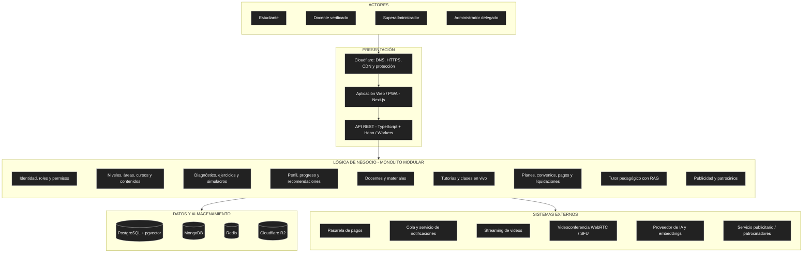

# Arquitectura inicial de Mentelyx

```mermaid

flowchart TD
    subgraph ACTORES["ACTORES"]
        Estudiante["Estudiante"]
        Docente["Docente verificado"]
        Superadmin["Superadministrador"]
        Delegado["Administrador delegado"]
    end

    subgraph PRESENTACION["PRESENTACIÓN"]
        Edge["Cloudflare: DNS, HTTPS, CDN y protección"]
        Web["Aplicación Web / PWA - Next.js"]
        API["API REST - TypeScript + Hono / Workers"]
    end

    subgraph NEGOCIO["LÓGICA DE NEGOCIO - MONOLITO MODULAR"]
        Identidad["Identidad, roles y permisos"]
        Academico["Niveles, áreas, cursos y contenidos"]
        Evaluacion["Diagnóstico, ejercicios y simulacros"]
        Aprendizaje["Perfil, progreso y recomendaciones"]
        GestionDocente["Docentes y materiales"]
        Tutorias["Tutorías y clases en vivo"]
        Comercial["Planes, convenios, pagos y liquidaciones"]
        TutorIA["Tutor pedagógico con RAG"]
        Publicidad["Publicidad y patrocinios"]
    end

    subgraph DATOS["DATOS Y ALMACENAMIENTO"]
        SQL[("PostgreSQL + pgvector")]
        NoSQL[("MongoDB")]
        Cache[("Redis")]
        Archivos[("Cloudflare R2")]
    end

    subgraph EXTERNOS["SISTEMAS EXTERNOS"]
        Pagos["Pasarela de pagos"]
        Notificaciones["Cola y servicio de notificaciones"]
        Video["Streaming de videos"]
        WebRTC["Videoconferencia WebRTC / SFU"]
        IA["Proveedor de IA y embeddings"]
        Anuncios["Servicio publicitario / patrocinadores"]
    end

    ACTORES --> Edge
    Edge --> Web
    Web --> API
    API --> NEGOCIO
    NEGOCIO --> DATOS
    NEGOCIO --> EXTERNOS

    Estudiante ~~~ Docente
    Docente ~~~ Superadmin
    Superadmin ~~~ Delegado

    Identidad ~~~ Academico
    Academico ~~~ Evaluacion
    Evaluacion ~~~ Aprendizaje
    Aprendizaje ~~~ GestionDocente
    GestionDocente ~~~ Tutorias
    Tutorias ~~~ Comercial
    Comercial ~~~ TutorIA
    TutorIA ~~~ Publicidad

    SQL ~~~ NoSQL
    NoSQL ~~~ Cache
    Cache ~~~ Archivos

    Pagos ~~~ Notificaciones
    Notificaciones ~~~ Video
    Video ~~~ WebRTC
    WebRTC ~~~ IA
    IA ~~~ Anuncios

    classDef oscuro fill:#222,stroke:#ddd,color:#fff
    class Estudiante,Docente,Superadmin,Delegado oscuro
    class Edge,Web,API oscuro
    class Identidad,Academico,Evaluacion,Aprendizaje,GestionDocente,Tutorias,Comercial,TutorIA,Publicidad oscuro
    class SQL,NoSQL,Cache,Archivos oscuro
    class Pagos,Notificaciones,Video,WebRTC,IA,Anuncios oscuro

```